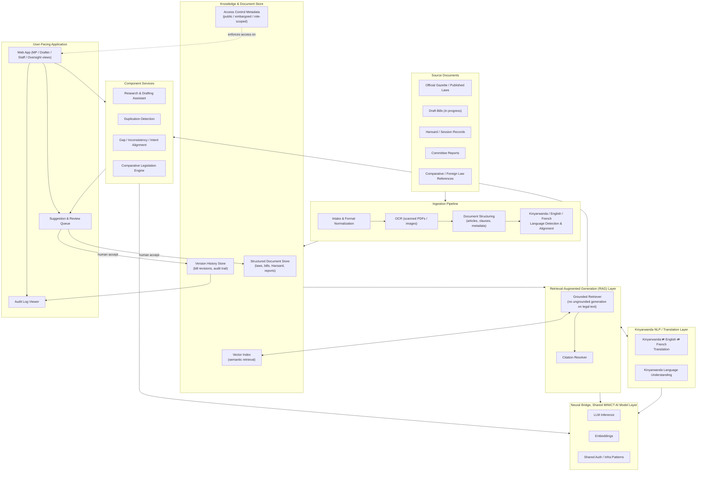

# Architecture: Parliament AI System (Legislative Intelligence)

**Owner institution:** Parliament of Rwanda
**Technology partner:** MINICT/RISA
**Document:** 3 of 7, Architecture

This document describes the proposed system architecture: how content enters the system, how it is stored and retrieved, how the four component services are built on top of a shared retrieval layer, how Kinyarwanda is supported throughout, and how the underlying AI infrastructure ("Neural Bridge," MINICT's shared LLM/AI model layer) fits in. It also covers the cloud-first, on-prem-later deployment path and what must be built cloud-side from day one to keep that migration realistic.

## 1. Design principles

1. **Grounded generation only for legal text.** No component may generate or alter legal-text-affecting content from open-ended model generation alone. Everything that touches the meaning of a law or bill goes through the retrieval-augmented generation (RAG) layer described in Section 3, with citations attached.
2. **One knowledge store, four consumers.** The four key components (research/drafting assistant, duplication detector, gap/inconsistency analyzer, comparative legislation engine) are separate services with separate purposes, but they all read from the same document/knowledge store and the same retrieval layer, so that "what the system knows" is consistent no matter which component is asked.
3. **Human-in-the-loop is structural, not optional.** Every service that produces a suggestion writes to a review/suggestion queue rather than to the authoritative document store directly. Only an explicit human accept action, performed by an authorized role, commits a change to a bill's version history.
4. **Cloud-first, on-prem-ready.** Every architectural choice is evaluated against the question: "does this still work if this component has to run inside Parliament's own data center with no path to the public internet?" Where a cloud-managed service is used for speed at launch, it is chosen to have a realistic self-hostable or on-prem equivalent (see Section 5).

## 2. Architecture overview

## 3. Ingestion pipeline

The parliamentary knowledge base is assumed, based on how legislatures typically hold this material, to exist today primarily as **scanned PDFs, Word documents, and paper archives** rather than clean structured text, this applies to older Official Gazette issues, historical Hansard records, and many committee reports. The ingestion pipeline must therefore support:

1. **Intake & format normalization**, accepts PDF, DOCX, scanned image, and (where available) structured exports; normalizes into a common intermediate format.
2. **OCR**, applies optical character recognition to scanned/image-based documents, with a quality-check step since OCR errors on legal text are unacceptable if left uncorrected (misread numbers, missed negations, etc. can invert legal meaning). Low-confidence OCR output is routed to a human review queue before it enters the authoritative store.
3. **Document structuring**, parses documents into addressable units (law → chapter → article → clause) with metadata (enactment date, amending instruments, status: in-force / repealed / draft / embargoed). This structure is what makes precise citation possible later (FR-C3 in `02-requirements.md`).
4. **Language handling**, detects source language (Kinyarwanda, English, French) and, where a document exists in multiple official versions, links them as aligned versions of the same legal text rather than independent documents.

New documents (freshly tabled bills, new Hansard records, new committee reports) enter through the same pipeline on an ongoing basis, not just as a one-time historical backfill.

## 4. Document/knowledge store and retrieval layer

- **Structured document store** holds the normalized, structured text of every ingested document with its metadata (source, date, status, classification, see `04-data-and-integrations.md` for classification rules).
- **Vector index** holds embeddings of document chunks (articles/clauses) to support semantic retrieval, finding conceptually related provisions even when wording differs, which is essential for duplication detection and gap analysis, not just keyword search.
- **Version history store** tracks every revision of every bill, including which changes originated as accepted AI suggestions, satisfying FR-C4 and the audit requirements in `05-security-compliance.md`.
- **Access control metadata** tags every document with its classification (public law, embargoed draft bill, internal committee report, etc.) and the roles permitted to see it; this metadata is enforced at the retrieval layer, not just in the UI, so that a component service cannot retrieve, and therefore cannot leak, content a user is not authorized to see.

The **RAG layer** sits between the knowledge store and the four component services. It is intentionally the *only* path by which any component generates content that references specific legal text:

- The **grounded retriever** takes a query (a research question, a draft clause, a comparative-law request) and returns the most relevant passages from the document store, scoped by the requesting user's access rights.
- The **citation resolver** attaches precise source references (document, article, clause) to every passage used, which is what allows every downstream output to carry a citation (FR-C3).
- Generation that is not backed by retrieved, citable passages is explicitly disallowed for anything that states or implies a fact about legal content. This is the architectural enforcement of NFR-3 (accuracy and hallucination controls), it is not a prompting convention, it is a hard constraint at the RAG layer: outputs without a resolvable citation are labeled ungrounded and blocked from any workflow that could affect a bill's text.

## 5. Component services

All four services consume the same retrieval layer and knowledge store described above; they differ in what they do with retrieved content.

- **Research & drafting assistant**, takes a research question or drafting request, retrieves grounded passages, and produces a cited answer, summary, translation, or draft. Draft output is written to the suggestion/review queue, never directly to a bill's authoritative version.
- **Duplication detection**, takes a draft clause or bill, retrieves semantically similar passages from across the entire corpus of laws and other draft bills (via the vector index), and scores/flags overlaps and contradictions with citations to the matching passages.
- **Gap, inconsistency & intent alignment**, takes a draft bill plus, optionally, a stated intent, retrieves related coverage from existing law and the bill's own other clauses, and flags missing coverage, vague phrasing, and wording that appears misaligned with the stated intent, each flag includes a plain-language rationale (per FR in `02-requirements.md`, Section 3).
- **Comparative legislation engine**, takes a subject or draft clause and retrieves relevant passages from the comparative/foreign-law reference collection described in `04-data-and-integrations.md`, producing a benchmarking summary with citations to the specific foreign provisions referenced.

## 6. Kinyarwanda NLP / translation layer

A dedicated layer handles Kinyarwanda ⇄ English ⇄ French translation and Kinyarwanda-specific language understanding (e.g., legal terminology that does not map 1:1 across languages). This layer sits alongside the RAG layer so that:

- A Kinyarwanda-language query can retrieve relevant passages regardless of the language the source document was originally written in.
- Output can be generated in the user's chosen language while citations still point to the actual source document, in its original language, with a note if the citation is to a translated version.

Kinyarwanda is treated as a first-class supported language architecturally, not as a translation bolt-on applied after the fact, consistent with the target of functional parity described in `02-requirements.md`.

## 7. Neural Bridge: shared MINICT AI model layer

"Neural Bridge" is MINICT/RISA's internal shared LLM/AI model infrastructure, also used by sibling ministry projects (for example, the RCB project's Lead Generator module). The Parliament AI System builds on Neural Bridge for:

- **LLM inference**, the underlying language model calls used for summarization, drafting, translation, and analytical reasoning across all four component services.
- **Embeddings**, the vector representations that power the vector index and semantic retrieval described in Section 4.
- **Shared auth and infra patterns**, MINICT/RISA's common authentication, service-to-service auth, and infrastructure conventions used across its portfolio, which this project adopts rather than building bespoke equivalents.

Building on Neural Bridge means this project does not own or operate raw model infrastructure directly; it consumes it as a platform service, consistent with MINICT/RISA's role as the cross-cutting technology partner across all ministry AI projects. Because Neural Bridge is shared infrastructure, any data governance constraint specific to Parliament (see `05-security-compliance.md`), particularly around embargoed draft bills, must be enforced at the point where the Parliament AI System calls into Neural Bridge (e.g., no retention of Parliament-submitted content by the shared layer beyond what is contractually agreed, and clear tenant/data isolation from other ministry projects using the same underlying infrastructure).

## 8. Deployment path: cloud-first, on-prem thereafter

Per the portfolio direction ("Cloud first, on-prem deployment thereafter"), the system launches on cloud infrastructure and migrates to an on-premises deployment inside Rwandan government infrastructure once the system, data pipeline, and institutional readiness support it.

### What changes when it moves on-prem

- **Data residency**, all knowledge store content, embeddings, version history, and audit logs move from cloud-hosted storage to storage physically located on government-controlled infrastructure. No parliamentary data is retained in the cloud environment after cutover except as required for a defined, time-boxed decommissioning/migration window.
- **Model hosting**, LLM inference and embeddings, currently served through Neural Bridge's cloud-hosted models, move to a self-hosted or on-prem-deployable model configuration. This requires Neural Bridge itself (or an on-prem-compatible profile of it) to support self-hosted model weights rather than only calling out to cloud-vendor model APIs.
- **Network isolation**, the on-prem deployment is isolated from the public internet and from other ministries' cloud-hosted environments to the degree required by Parliament's confidentiality needs (see `05-security-compliance.md`), with controlled, audited exceptions only where explicitly required (e.g., a narrowly scoped, monitored connection for public Official Gazette lookups or comparative foreign-law reference updates).
- **Operations**, monitoring, backup, and incident response move from cloud-managed tooling to infrastructure operated by MINICT/RISA on Parliament's behalf, following whatever government infrastructure operations model MINICT/RISA runs for on-prem workloads across its portfolio.

### What must be built cloud-side from day one to avoid a rewrite

- **Containerized services**, every component service (ingestion, retrieval, the four component services, the Kinyarwanda layer, the application backend) is packaged as a container from the start, so that "move to on-prem" is a redeployment target change, not a re-architecture.
- **No cloud-vendor-locked APIs**, the system avoids building hard dependencies on cloud-vendor-proprietary managed services that have no on-prem equivalent (e.g., proprietary managed search or proprietary managed vector databases without a self-hostable option). Where a managed cloud service is used for speed, it is chosen to have a drop-in self-hostable equivalent (e.g., a vector index technology available both as a managed cloud offering and as a self-hosted deployment).
- **Self-hostable model options**, inference and embedding calls go through Neural Bridge's abstraction rather than being hard-coded to a specific cloud model provider, so that swapping the underlying model deployment (cloud-hosted today, self-hosted on-prem later) does not require changes in the four component services.
- **Externalized configuration for environment-specific concerns**, network endpoints, storage locations, and identity providers are configuration, not code, so that the same service images run in both the cloud and on-prem environments.
- **Data export/import discipline**, the knowledge store, version history, and audit log formats are designed to be fully exportable/importable from day one, since the on-prem migration is fundamentally a large, sensitive data migration and must be rehearsed, not improvised.

## 9. Related documents

- `02-requirements.md`, the functional and non-functional requirements this architecture satisfies
- `04-data-and-integrations.md`, detail on data sources, classification, and external integrations referenced in Sections 3 and 4
- `05-security-compliance.md`, detail on access control, audit logging, and the security implications of the on-prem transition in Section 8
- `06-roadmap-and-team.md`, how this architecture is delivered in phases
